# Sudoku Game 🧩

A modern, responsive Sudoku game built with JavaScript, Node.js, and deployed on AWS infrastructure.

## 🎮 Demo Project

This is a demonstration project showcasing modern web development practices and cloud deployment using:

- **Frontend**: Vanilla JavaScript, HTML5, CSS3
- **Backend**: Node.js with Express
- **Cloud Infrastructure**: AWS EC2, AWS Elastic Beanstalk
- **Containerization**: Docker & Docker Hub
- **CDN & SSL**: Cloudflare

## 🎯 Features

- **Two Difficulty Modes**: Easy and Normal
- **Responsive Design**: Works on desktop and mobile devices
- **Real-time Validation**: Instant feedback on number placement
- **Visual Feedback**: Color-coded cells for errors, success, and selection
- **Modern UI**: Gradient backgrounds, smooth animations, and intuitive controls
- **Auto-solve Detection**: Automatically detects when puzzle is completed
- **Game State Persistence**: Automatically saves your progress in browser storage
- **Multi-User Sessions**: Each user gets their own isolated game session
- **Session Recovery**: Handles server restarts and session expiration gracefully
- **Hint System**: Get hints for specific cells when stuck

## 🚀 Quick Start

### Diagram

```mermaid
flowchart TD
    %% User Layer
    Browser["User's Browser"]:::frontend

    %% CDN
    CDN["Cloudflare CDN"]:::frontend

    %% AWS Cloud
    subgraph "AWS Elastic Beanstalk & Compute"
        LB["EB Load Balancer\n(Elastic Beanstalk)"]:::infra
        EC2["EC2 Instance"]:::infra
        Container["Docker Container\n(Node.js/Express)"]:::infra
    end

    %% Build & Deployment Pipeline
    subgraph "Build & Deployment Pipeline"
        ScriptsBuild["build.js"]:::pipeline
        ScriptsVersion["version.sh"]:::pipeline
        ScriptsDeploy["cloud_deploy.sh"]:::pipeline
        DockerHub["Docker Hub"]:::pipeline
    end

    %% Infra Configuration
    subgraph "Infrastructure Configuration"
        DockerfileCfg["Dockerfile"]:::pipeline
        DockerfileProd["Dockerfile.production"]:::pipeline
        ComposeCfg["docker-compose.yml"]:::pipeline
        DockerrunCfg["Dockerrun.aws.json"]:::pipeline
        EBConfig[".ebextensions/single-instance.config"]:::pipeline
    end

    %% Frontend & Backend Code
    subgraph "Application Code"
        IndexHTML["index.html"]:::frontend
        StyleCSS["style.css"]:::frontend
        CriticalCSS["critical.css"]:::frontend
        ScriptJS["script.js"]:::frontend
        ServerJS["server.js"]:::infra
        PackageJSON["package.json"]:::infra
        PackageLock["package-lock.json"]:::infra
    end

    %% Relationships
    Browser -->|GET static assets / API calls| CDN
    CDN -->|SSL/TLS Termination & Cache| LB
    LB -->|Forwards Traffic| EC2
    EC2 -->|Runs Container| Container
    Container -->|Serves HTML/CSS/JS & API JSON| CDN
    Container -->|In-memory session recovery| Container

    %% Build Pipeline Flow
    ScriptsBuild --> IndexHTML
    ScriptsBuild --> StyleCSS
    ScriptsBuild --> CriticalCSS
    ScriptsBuild --> ScriptJS
    ScriptsVersion -->|bump version| PackageJSON
    ScriptsVersion --> PackageLock
    ScriptsDeploy --> DockerHub
    DockerHub -->|Deploy Image| LB

    %% Infra Config usage
    DockerfileCfg --> Container
    DockerfileProd --> Container
    ComposeCfg --> Container
    DockerrunCfg --> EC2
    EBConfig --> LB

    %% Click Events
    click DockerfileCfg "https://github.com/cohuk/sudoku/tree/main/Dockerfile"
    click DockerfileProd "https://github.com/cohuk/sudoku/blob/main/Dockerfile.production"
    click ComposeCfg "https://github.com/cohuk/sudoku/blob/main/docker-compose.yml"
    click DockerrunCfg "https://github.com/cohuk/sudoku/blob/main/Dockerrun.aws.json"
    click EBConfig "https://github.com/cohuk/sudoku/blob/main/.ebextensions/single-instance.config"
    click ScriptsBuild "https://github.com/cohuk/sudoku/blob/main/scripts/build.js"
    click ScriptsVersion "https://github.com/cohuk/sudoku/blob/main/scripts/version.sh"
    click ScriptsDeploy "https://github.com/cohuk/sudoku/blob/main/scripts/cloud_deploy.sh"
    click ServerJS "https://github.com/cohuk/sudoku/blob/main/backend/server.js"
    click PackageJSON "https://github.com/cohuk/sudoku/blob/main/package.json"
    click PackageLock "https://github.com/cohuk/sudoku/blob/main/package-lock.json"
    click IndexHTML "https://github.com/cohuk/sudoku/blob/main/frontend/index.html"
    click StyleCSS "https://github.com/cohuk/sudoku/blob/main/frontend/style.css"
    click CriticalCSS "https://github.com/cohuk/sudoku/blob/main/frontend/critical.css"
    click ScriptJS "https://github.com/cohuk/sudoku/blob/main/frontend/script.js"

    %% Styles
    classDef frontend fill:#85C1E9,stroke:#1B4F72,color:#1B2631
    classDef infra fill:#82E0AA,stroke:#1D8348,color:#145A32
    classDef pipeline fill:#F7DC6F,stroke:#B7950B,color:#7E5109
```



### Local Development

1. **Clone the repository**

   ```bash
   git clone <repository-url>
   cd Sudoku
   ```

2. **Install dependencies**

   ```bash
   npm install
   ```

3. **Start the server**

   ```bash
   npm start
   ```

4. **Open your browser**

   Navigate to `http://localhost:3000`

### Docker Deployment

```bash
# Build and run with Docker
docker build -t sudoku-game .
docker run -d -p 80:3000 --name sudoku-container sudoku-game

# Or use Docker Compose
docker-compose up -d
```

## ☁️ Cloud Deployment

### AWS Elastic Beanstalk (Recommended)

```bash
# Deploy to AWS
npm run cloud-deploy
```

This script will:

1. Build the Docker image
2. Push to Docker Hub
3. Deploy to AWS Elastic Beanstalk

### Manual AWS Deployment

```bash
# Initialize EB (first time only)
eb init

# Create environment
eb create sudoku-production --single

# Deploy updates
eb deploy
```

## 🌐 Live Demo

- **Production URL**: [https://sudoku.strongin.qa](https://sudoku.strongin.qa)
- **AWS EB URL**: Available after deployment

## 🛠️ Technology Stack

### Frontend

- **HTML5**: Semantic markup
- **CSS3**: Flexbox, Grid, animations, responsive design
- **JavaScript (ES6+)**: Modern JavaScript features, async/await
- **Progressive Web App**: Mobile-optimized input handling

### Backend

- **Node.js**: Runtime environment
- **Express.js**: Web framework
- **CORS**: Cross-origin resource sharing
- **Static File Serving**: Frontend asset delivery
- **Session Management**: Multi-user session handling
- **Game State API**: RESTful endpoints for game operations
- **Hint System**: Server-side puzzle solving and hint generation

### Infrastructure

- **Docker**: Containerization
- **AWS EC2**: Virtual servers
- **AWS Elastic Beanstalk**: Platform-as-a-Service
- **Docker Hub**: Container registry
- **Cloudflare**: CDN, SSL, and DNS management

## 📁 Project Structure

```text
Sudoku/
├── backend/
│   └── server.js          # Express server
├── frontend/
│   ├── index.html         # Main HTML file
│   ├── script.js          # Game logic and UI
│   ├── style.css          # Styling and responsive design
│   ├── critical.css       # Critical above-the-fold CSS
│   ├── script.min.js      # Minified JavaScript (generated)
│   ├── style.min.css      # Minified CSS (generated)
│   └── index.optimized.html # Optimized HTML (generated)
├── scripts/
│   ├── build.js           # Build optimization script
│   ├── version.sh         # Version management script
│   ├── cloud_deploy.sh    # Cloud deployment script
│   └── README.md          # Scripts documentation
├── docker-compose.yml     # Docker Compose configuration
├── Dockerfile             # Docker image definition
├── Dockerfile.production  # Production Docker image
├── Dockerrun.aws.json     # AWS EB configuration
├── package.json           # Node.js dependencies and scripts
└── README.md              # This file
```

## 🎮 How to Play

1. **Select Difficulty**: Choose between Easy or Normal mode
2. **Fill the Grid**: Click on empty cells and enter numbers 1-9
3. **Follow Sudoku Rules**:

   - Each row must contain numbers 1-9 without repetition
   - Each column must contain numbers 1-9 without repetition
   - Each 3x3 box must contain numbers 1-9 without repetition
4. **Get Feedback**: The game provides real-time validation
5. **Use Hints**: Click on a cell and press the Hint button for help
6. **Complete the Puzzle**: Fill all cells correctly to win!

## 💾 Game State & Sessions

### Automatic State Saving
- **Browser Storage**: Your game progress is automatically saved in localStorage
- **Page Refresh**: Your game state persists across browser refreshes
- **Session Recovery**: If the server restarts, your session is automatically recovered
- **Multi-Device**: Each browser/device maintains its own game state

### Multi-User Support
- **Session Isolation**: Each user gets their own unique session ID
- **Concurrent Games**: Multiple users can play simultaneously without interference
- **Session Validation**: The app automatically detects and handles invalid sessions
- **Graceful Recovery**: If your session becomes invalid, the app starts fresh automatically

### Session Management
- **Client-Side**: Session ID is generated and stored in browser localStorage
- **Server-Side**: Each session maintains its own game state and puzzle
- **Automatic Cleanup**: Invalid sessions are automatically cleared and recreated
- **No Data Loss**: Game state is preserved even during server maintenance

## 🔌 API Endpoints

The backend provides several RESTful endpoints for game functionality:

### Game Management
- `GET /api/new-game` - Start a new Sudoku puzzle
- `GET /api/game-state` - Get current game state
- `GET /api/version` - Get application version information

### Game Operations
- `POST /api/validate-move` - Validate a number placement
- `GET /api/hint?row=X&col=Y` - Get hint for specific cell
- `POST /api/validate-board` - Validate entire board

### Session Management
- `GET /api/session/validate` - Check if session is valid

All endpoints support session-based authentication via `X-Session-ID` header.

## 🔧 Development Scripts

```bash
# Development
npm start              # Start the development server
npm run build          # Build optimized production files

# Version Management
./scripts/version.sh patch    # Bump patch version
./scripts/version.sh minor    # Bump minor version
./scripts/version.sh major    # Bump major version
./scripts/version.sh show     # Show current version

# Deployment
./scripts/cloud_deploy.sh     # Deploy to AWS cloud infrastructure
npm run cloud-deploy          # Deploy to AWS (npm script)

# Docker
npm run docker:build          # Build Docker image
npm run docker:run            # Run Docker container
```

## 📱 Mobile Support

The game is fully responsive and optimized for mobile devices:

- Touch-friendly interface
- Mobile-optimized number input
- Responsive grid layout
- Swipe and tap interactions
- Persistent game state across mobile sessions

## 🚀 Deployment Architecture

```text
Internet → Cloudflare CDN → AWS Elastic Beanstalk → EC2 Instance → Docker Container
```

- **Cloudflare**: Provides CDN, SSL termination, and DDoS protection
- **AWS EB**: Manages application deployment and scaling
- **EC2**: Runs the containerized application
- **Docker**: Ensures consistent deployment across environments

## 💰 Cost

This project is designed to run **completely free** for the first year (6 months, if you have a new AWS free-tier):

- **AWS Free Tier**: t2.micro EC2 instance
- **Cloudflare Free Plan**: CDN and SSL
- **Docker Hub**: Free public repositories

## 🤝 Contributing

This is a demo project, but contributions are welcome! Feel free to:

- Report bugs
- Suggest new features
- Submit pull requests
- Improve documentation

## 📄 License

This project is open source and available under the [MIT License](LICENSE).

## 🔗 Links

- **Live Demo**: [https://sudoku.strongin.qa](https://sudoku.strongin.qa)
- **AWS Elastic Beanstalk**: [AWS Console](https://console.aws.amazon.com/elasticbeanstalk/)
- **Docker Hub**: [Container Registry](https://hub.docker.com/)
- **Cloudflare**: [DNS Management](https://dash.cloudflare.com/)

---

## Built with ❤️ using modern web technologies and cloud infrastructure
